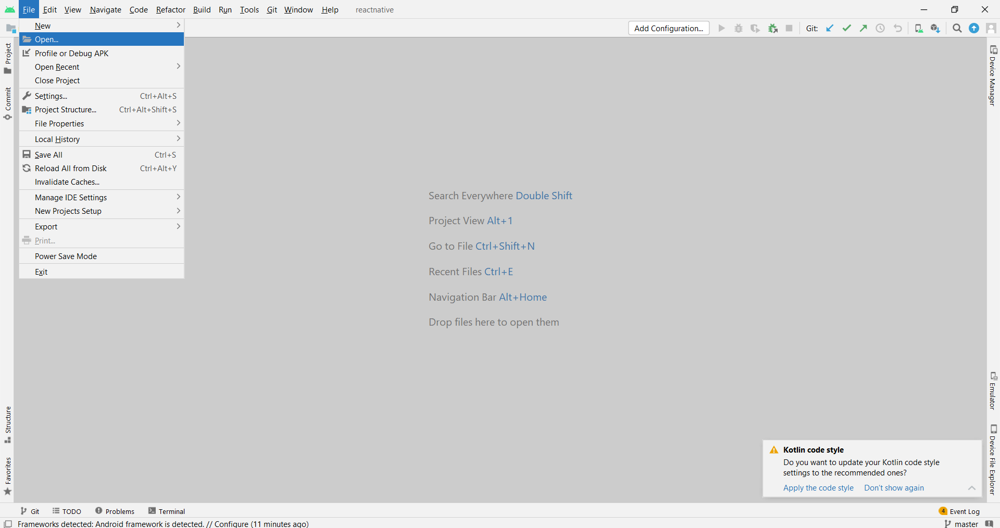

# <b>Introduction</b>

## React-native
React-native is the framework to develop the android or ios applications.native codes are written for the particular process which run programs in related processors only rather than another one.In simple android applications cannot run as the windows or mac os web applications. React developed by the facebook and most popular framework.


<h3><b>1.Node js</b></h3>
 <br>
 <p>Node javascript [js] is open-source and cross platfrom ,intrepreter language . It was developed in 2009 , the most unique adavantage of node.js is it can be used for client-side[front-end] and server-side[back-end] programming,As per nodejs official docs
 <br>
 <code>
    <i> 
        "A Node.js app runs in a single process, without creating a new thread for every request. When Node.js performs an I/O operation, like reading from the network, accessing a database or the filesystem, instead of blocking the thread and wasting CPU cycles waiting, Node.js will resume the operations when the response comes back."
    </i>
 </code>
 </p>


<h3><b>2.Java development kit.</b></h3>
<br>
<p>
    Java Development Kit   which is used for software development Environment,It contains two component Java Virtual Machine <b>JVM</b> and Java Runtime Environment <b>JRE</b> .To avoid confusions let puts in simple terms JVM is  part of JRE used to execute the bytecode and JRE is used to execute only java programs.To develop any software environment or connections to databases requires JDK it is collection of pacakages and tools.
</p>


<h4><b>3.Android Studio</b></h4>
<br>
<p>
    Android studio is the Integrated development ENvironment which is used to develop any android apllication or ios application. It has command line interface <b>CLi</b> of any framework like react,flutter,ionic etc., Android studio provides configuration Android Device Manager where we can view the UI of developement application.In this we have two options Pyhiscal device, VIrtual Device utitlity.
</p>
    <br>
    <b>Physical Device : </b>If you have a physical Android device, you can use it for development in place of an AVD by plugging it in to your computer using a USB cable. 
    <br>
    <b>Virtual Device : </b> "Create Virtual Device...", then pick any Phone from the list 
</p>


<h4><b>4.git</b></h4>
<br>
<P>
    Git is the most commonly used version control system (VCS). Git tracks the changes you made to the files, so you have a record of what changes you made, and you can revert to specific versions whenever you need it.
</p>


# <b>Installation dependencies for React native CLI(Windows Environment  Setup)</b>

To Build React-native application require Node,JDK,Android Studio,React native CLI.
<br> 

There are two ways to install dependencies,but use chocolatey at once it can install multiple softwares.

1. Individual downloads.
```python
Download

# Nodejs
https://nodejs.org/en/download/
# jdk
https://www.oracle.com/java/technologies/downloads/#jdk18-windows
#Android Studio
https://developer.android.com/studio
#REact-Native library install from command prompt
npm i react-native
# Download git
https://git-scm.com/download/win
```
2. Download using chocolatey using cmd.(popular package manager for Windows)

```python
# install chocolatey pacakge manager using command prompt(paste below lin in cmd)
@"%SystemRoot%\System32\WindowsPowerShell\v1.0\powershell.exe" -NoProfile -InputFormat None -ExecutionPolicy Bypass -Command "[System.Net.ServicePointManager]::SecurityProtocol = 3072; iex ((New-Object System.Net.WebClient).DownloadString('https://community.chocolatey.org/install.ps1'))" && SET "PATH=%PATH%;%ALLUSERSPROFILE%\chocolatey\bin"
# install node js, openjdk and git
choco install -y nodejs-lts openjdk11
choco install git.install
# Download ANdroid Studio
https://developer.android.com/studio/index.html
```

# <b>Configure the ANDROID_HOME environment variable</b>

1. Add Envieonment variable for Android

    click on windows key > type "edit the environment varibles" > click on Environment variables button > user/system varibales select new .
```
variable name  : ANDRIOD_HOME
variable value : C:\Users\saira\AppData\Local\Android\Sdk
```
2. Add sdk to system/user path.
    click on windows key > type "edit the environment varibles" > click on Environment varibales button > user varibales select path paste below
```
%LOCALAPPDATA%\Android\Sdk\platform-tools
```
3. Check configuration 
    open powershell use below command
```
Get-ChildItem -Path Env:\  # verify ANDRIOD_HOME
```

# <b> Create react-native application </b>

Create application in any of the below methods.

1. Using Android Studio
2. Using CLI

#### <b>1.Using Android Studio</b>

1. open Android Studio

2. File > New > New Project 


3. select Phone and Tablet >  Basic activity > Next


4. click on  
Name field and give app name as firstapp <br>
savelocation browse the directory to save the app file
Finish


5. Now check app in Android Window 


#### <b>2.Using CLI(command Line Interface)</b>

1. create new Folder in your local system drive

2. Now open that Folder with Android studio




3. Open the Terminal (View > Tool windows > Terminal)


4. Run this command in terminal
```python
npx react-native init firstapp
```

5. Now check app in Android Window 


# <b>Preparing the Android Device (Virtual/physical)</b>

#### <b>1.Virtual Device</b>

open Tools > SDK Manager 

Select the <b>"SDK Platforms"</b> tab from within the SDK Manager, then check the box next to "Show Package Details" in the bottom right corner. Look for and expand the Android 12 (S) entry, then make sure the following items are checked:

<i>Android SDK Platform 31<br>
Intel x86 Atom_64 System Image or Google APIs Intel x86 Atom System Image </i>

Next, select the <b>"SDK Tools"</b> tab and check the box next to "Show Package Details" here as well. Look for and expand the "Android SDK Build-Tools" entry, then make sure that 31.0.0 is selected.

Finally, click "Apply" to download and install the Android SDK and related build tools.

Now enable the device simulator

Tools > Device Manager > click play button


#### <b>2.Physical Device</b>

<b>1. Enable Debugging over USB</b>
<br>
Most Android devices can only install and run apps downloaded from Google Play, by default. You will need to enable USB Debugging on your device in order to install your app during development.

To enable USB debugging on your device, you will first need to enable the "Developer options" menu by going to Settings → About phone → Software information and then tapping the Build number row at the bottom seven times. You can then go back to Settings → Developer options to enable "USB debugging".

<b>2. Plug in your device via USB</b>
<br>
Let's now set up an Android device to run our React Native projects. Go ahead and plug in your device via USB to your development machine.

Now check that your device is properly connecting to ADB, the Android Debug Bridge, by running <b>adb devices,</b> in Android terminal.

```
$ adb devices
List of devices attached
emulator-5554 offline   # Google emulator
14ed2fcc device         # Physical device
```
# Run the application

<b>1. Start Metro</b><br>
First, you will need to start Metro, the JavaScript bundler that ships with React Native. Metro "takes in an entry file and various options, and returns a single JavaScript file that includes all your code and its dependencies."—Metro Docs

To start Metro, run npx react-native start inside your React Native project folder:
```
npx react-native start
```

<b>2. Start your application</b><br>
Let Metro Bundler run in new terminal. Open a new terminal inside your React Native project folder. Run the following:
```
npx react-native run-android
```


<b>Note :</b>

For more info. about env setup refer this link

<a src="https://reactnative.dev/docs/environment-setup">https://reactnative.dev/docs/environment-setup</a>