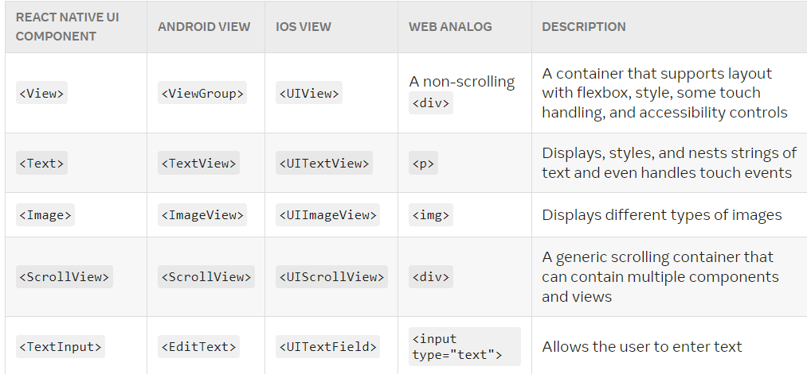

# React Fundamentals

## JSX

* JSX is javascript extenstion which converts <b>javascript XML  ---> javasccript ---> HTML</b> using babel compiler. This scripts are written in the .js file. Below is the code  written in the different language but do the same thing .
* The advantage of using react JSX is instead of writting code explicilty using different files here writes every thing in javascript language and in .js file.

### HTML
```html
<!-- index.html -->

<div>Hello</div>
```
### Javascript
```javascript
// index.js

let ptag = document.createElement("p");  
ptag.innerHTML = "hello"                  
document.body.appendChild(ptag)     
// <div>Hello</div>
```
### React
```javascript
// index.js

import React from "react"  
import ReactDOM from 'react-dom/client';
const root = ReactDOM.createRoot(document.getElementById('root'));
root.render(
    <div>Hello World</div>
);
```

### React-native
```javascript
// app.json
{
  "name": "testapp",
  "displayName": "testapp"
}
// index.js
import {Text,AppRegistry} from 'react-native';
import {name as appName} from './app.json';
import React from 'react';

const App = () =>{
   return (
        <Text>Hello world!</Text>
   );
};

AppRegistry.registerComponent(appName,()=>App);
```

## Components

* Component is an object which has properties,states,attributes,characteristics and functions.
* Components holds the HTML,CSS,javascript in the form of <b>JSX</b> .

### <b>Core components:</b>
* Components defined in their own language called the core components.
* To develope any ANdroid application the base language is java or kotlin comes to the IOS app the base language is Objective-c or swift.

### <b>Native components: </b>

* Components are defined in javascript language these are unique and works same in android and ios applications , so it is called native components.

* At run time the native components calls the core components with javascript using babel compiler/transpiler.

To avoid confusions look into the below table there you can understand whole definition of core and native components.



## React Components

In react components are classified into two types htat are functional components are class components. This both components folows different syntax and methods. Its developer choice to use any kind of the components.

let see the difference of both components

### <b> Function components</b>.

* Functional components syntax are pure form of javascript functions.
* No constructor will be used to define the sates.
* It is stateless component.
* No react statelife cycle will be used
* Hooks are used to makes the components statefull.

```javascript
// syntax
function ComponentName(){
  // hooks
  // any functions
  // return render components
}
//-------------Example: -----------------------------
import React,{useState} from "react";

function App(){
  return(
    <div>
        <h1>Function Component</h1>
    </div>
  )
}
```

### <b>class component</b>
* Class based components should extend from react library. It syntax is different
* Constructors are used to store state data
* It is state-full component
* State life cycle being used
* Hooks will not work in class components

```javascript
// class syntax
class className extends Component {
  constructor(props){
    super(props)
    // state value
  }
  // life cycle states
  // any functions
  // render component
}
//------------Example:-----------------------
import React,{Component} from "react";
class Add extends Component{

  render(){
    return(
      <div>
        <h1>Class Component</h1>
      </div>
    )
  }
}
```
## Hooks

Hooks are used to mount,update and unmount the data. To store and manipulate data , the react provides states and side effects.
* Only call Hooks at the top level. Don’t call Hooks inside loops, conditions, or nested functions.
* Only call Hooks from React function components. Don’t call Hooks from regular JavaScript functions. 

```javascript
function App(){
  const [countx,setcountx] = useState(0);
  let incre = () => {
    setcountx(countx+1)
  }
  return(
    <div>
        <h1>Function Component</h1>
        <button onClick={incre}>Count {countx}</button>
    </div>
  )
}
```

## Props

Props are the properties which acts like javascript object and are mutable.props will be send as a parameter to the components, so these props are acessible inside and outside the components.

```javascript
function BioData(props){
    return (
        <ul> 
          <li>Name: {props.name}</li>  
          <li>Age: {props.age}</li>    
          <li>Gender : {props.gender}</li>
       </ul>)
     
  }
function BioDetails(){
    // Assume like its variable with object 
    // BioData = {name :"joe", age:"25",gender:"male"}
    return (
      <div>
        <BioData name="Joe" age="25" gender="male"/>
      </div>
    )
  }
```